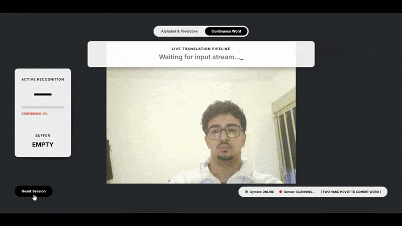

# ASL-ML: Real-Time American Sign Language Translator




## Overview

ASL-ML is a real-time American Sign Language (ASL) translation system that converts hand gestures into text. The project combines computer vision, deep learning, and natural language processing to provide a seamless communication experience for ASL users.

The system operates in two modes:

1. **Static Alphabet Mode**: Translates individual ASL alphabet letters (A-Z) plus space, delete, and nothing gestures.
2. **Dynamic Word Mode**: Recognizes complete words from continuous hand movements, enabling more natural communication.

## Why This Project

I built this project to bridge communication gaps between deaf and hearing individuals. Learning ASL requires significant time and practice, and not everyone has access to qualified interpreters or ASL instructors.

The core challenge was creating a system that works reliably across different users and hand sizes. Many hand gesture recognition systems are trained on limited datasets and fail when used by people different from the original training subjects. To address this:

1. **Static Model Training**: I trained the letter recognition model on a public ASL alphabet dataset containing images from multiple users with varying hand sizes and skin tones.

2. **Dynamic Model Training**: I personally recorded hand landmark data for dynamic words ("hello", "help", "yes", "no", "thank you") using MediaPipe. To ensure the model generalizes well to other users, I applied translation and scale-invariant normalization to the landmark data. This preprocessing ensures the model focuses on hand shape and movement patterns rather than absolute position or hand size.

The result is a system that works reliably not only on my hand but also on other people's hands.

## Features

### Real-Time Hand Tracking

- Uses Google MediaPipe Hand Landmarker to extract 21 hand landmarks (x, y, z coordinates) at 30+ FPS
- Supports single and dual hand tracking
- Draws hand skeleton overlay on video feed for visual feedback

### Static Letter Recognition

- 29-class classifier for ASL alphabet (A-Z, space, delete, nothing)
- Custom-trained neural network using PyTorch
- Model exported to ONNX format for fast inference
- Stabilization logic prevents flickering predictions by requiring consistent letter recognition across multiple frames

### Dynamic Word Recognition

- LSTM-based model for continuous gesture recognition
- Processes sequences of 30 frames (approximately 1 second of video)
- Currently supports words: "hello", "help", "yes", "no", "thank you"
- Can be extended to additional words with more training data

### Intelligent Word Prediction

- Integrates GPT-2 language model for context-aware word suggestions
- Suggests words based on partial letter input and sentence context
- Falls back to common word dictionary when GPT-2 is unavailable

### Virtual Cursor System

- Two-handed gesture control for suggestion selection
- Index finger tracking with pinch-to-grab functionality
- Visual feedback showing cursor position and grab state

### Two Recognition Modes

| Mode     | Description                               | Use Case                             |
| -------- | ----------------------------------------- | ------------------------------------ |
| Alphabet | Single letter recognition with prediction | Spelling words, fingerspelling       |
| Dynamic  | Complete word recognition                 | Faster communication, common phrases |

## System Architecture

```
                    Webcam Feed
                        |
                        v
              +-----------------+
              |  React Frontend |
              +-----------------+
                        |
              WebSocket (base64 frames)
                        |
                        v
              +-----------------+
              | FastAPI Backend |
              +-----------------+
                        |
          +-------------+-------------+
          |             |             |
          v             v             v
    +----------+   +---------+   +----------+
    | MediaPipe|   | Letter  |   |  Word    |
    | Hand     |-->| Recognizer|-->| Predictor|
    | Tracker  |   | (ONNX)  |   | (GPT-2)  |
    +----------+   +---------+   +----------+
          |             |
          v             v
    +----------+   +---------+
    | Stabilizer|  | Dynamic   |
    | (frames)  |  | Recognizer|
    +----------+   +---------+
          |             |
          +------+------+
                 |
                 v
          Response (text, suggestions, video)
```

## Project Structure

```
ASL-ML/
├── backend/                 # Python FastAPI backend
│   ├── main.py             # WebSocket server, request handling
│   ├── hand_tracker.py     # MediaPipe hand tracking
│   ├── letter_recognizer.py# Static letter classification
│   ├── dynamic_recognizer.py# Dynamic word recognition
│   ├── stabilizer.py       # Prediction stabilization
│   ├── word_predictor.py   # GPT-2 based suggestions
│   ├── hover_detector.py   # Virtual cursor logic
│   ├── requirements.txt    # Python dependencies
│   └── tests/              # Unit tests
│
├── frontend/               # React frontend
│   ├── src/
│   │   ├── components/    # UI components
│   │   ├── hooks/         # Custom React hooks
│   │   ├── utils/         # Constants, utilities
│   │   ├── App.jsx       # Main application
│   │   └── App.css       # Styles
│   └── package.json       # Node dependencies
│
├── models/                 # Trained models (in repository)
│   ├── letter_model/      # Static letter classifier
│   │   ├── asl_model.onnx
│   │   ├── config.json
│   │   ├── label_map.json
│   │   └── scaler.pkl
│   └── dynamic_model/     # Dynamic word classifier
│       ├── dynamic_model.onnx
│       └── label_map.json
│
├── scripts/               # Utility scripts
│   ├── test_webcam.py    # Test MediaPipe setup
│   ├── test_word_predictor.py # Test GPT-2 integration
│   ├── record_custom_data.py   # Record dynamic gesture data
│   ├── setup_dynamic_data.py  # Process recorded data
│   ├── train_dynamic_model.py  # Train LSTM model
│   ├── validate_custom_data.py# Validate recorded data
│   └── download_hf_model.py    # Download GPT-2
│
├── data/                  # Data files
│   ├── processed/        # Processed MediaPipe model
│   └── dynamic/          # Custom recorded gestures
│
├── docker-compose.yml    # Docker orchestration
├── requirements.txt      # Python dependencies
└── README.md            # This file
```

## Requirements

### Software Requirements

- Python 3.10 or higher
- Node.js 18 or higher
- Webcam (built-in or external)

## Installation

### 1. Clone the Repository

```bash
git clone https://github.com/YOUR_USERNAME/ASL-ML.git
cd ASL-ML
```

### 2. Backend Setup

Create and activate a virtual environment:

```bash
# Windows
cd backend
python -m venv venv
venv\Scripts\activate

# macOS / Linux
cd backend
python3 -m venv venv
source venv/bin/activate
```

Install Python dependencies:

```bash
pip install -r requirements.txt
```

Download required models:

```bash
# Download MediaPipe hand landmarker model
python ../scripts/download_mediapipe_model.py

# Download GPT-2 (optional, will download automatically on first run)
python ../scripts/download_hf_model.py
```

### 3. Frontend Setup

Install Node.js dependencies:

```bash
cd frontend
npm install
```

### 4. Running the Application

#### Option A: Run without Docker

Start the backend server:

```bash
cd backend
python main.py
```

The backend will start on `http://localhost:8000`. You should see:

```
INFO:     Application startup complete.
INFO:     Uvicorn running on http://0.0.0.0:8000
```

Start the frontend (in a new terminal):

```bash
cd frontend
npm start
```

The frontend will open at `http://localhost:3000`.

#### Option B: Run with Docker

```bash
docker-compose up --build
```

This will start both the backend and frontend containers.

## Usage Guide

### Starting a Session

1. Allow camera access when prompted
2. Wait for "System: ONLINE" and "Sensor: ACTIVE" status indicators
3. Position your hand in the camera view

### Alphabet Mode

1. Make ASL alphabet gestures (A-Z)
2. The system requires 8 consistent frames before accepting a letter
3. Letters appear in the "Buffer" section
4. Use the space gesture to complete a word and add to sentence
5. Use delete gesture to remove the last letter

### Word Prediction

1. Type 1-2 letters using alphabet mode
2. Word suggestions appear below the video feed
3. Hover over a suggestion with your index finger
4. Complete the hover (5-6 frames) to select the word

### Dynamic Word Mode

1. Click "Continuous Word" tab
2. Make a complete gesture for a word (approximately 1 second)
3. The system recognizes the word and adds it to your sentence
4. Wait 1 second before attempting another word

### Virtual Cursor (Two-Handed Control)

1. Show two hands in the camera view
2. A red dot appears showing cursor position
3. Pinch with either hand to grab the cursor
4. Move your hand to drag the cursor
5. Release pinch to drop the cursor

### Resetting the Session

1. Click "Reset Session" button
2. Clears current word buffer and sentence

## Model Training Details

### Static Letter Model

- **Architecture**: Fully connected neural network (3 hidden layers)
- **Input**: 63 values (21 landmarks x 3 coordinates, normalized)
- **Output**: 29 classes (A-Z, space, delete, nothing)
- **Training Data**: Public ASL alphabet dataset (~3000 images per letter)
- **Preprocessing**: Translation to wrist, scale normalization to max landmark distance
- **Training Framework**: PyTorch

### Dynamic Word Model

- **Architecture**: LSTM (2 layers, 128 hidden units)
- **Input**: 126 values per frame (2 hands x 21 landmarks x 3 coordinates)
- **Sequence Length**: 30 frames
- **Output**: 5 classes (hello, help, yes, no, thank you)
- **Training Data**: Custom recordings (approximately 100 samples per word)
- **Preprocessing**: Per-frame translation and scale normalization
- **Training Framework**: PyTorch, exported to ONNX for inference

### Data Collection Process (Dynamic Words)

1. Used MediaPipe to record hand landmarks while performing gestures
2. Normalized each frame using translation and scale invariance
3. Created 30-frame sequences by splitting longer recordings
4. Applied data augmentation (slight translations, time shifts)
5. Split into 80% training, 20% validation

## Troubleshooting

### Camera Not Working

- Ensure no other application is using the camera
- Check browser permissions for camera access
- Try using a different browser (Chrome recommended)

### Model Not Loading

- Verify models are in the correct directories
- Run download scripts to fetch missing models
- Check console for specific error messages

### Poor Recognition Accuracy

- Ensure good lighting on your hands
- Keep hand steady during letter recognition
- Position hand within the camera frame
- For dynamic words, perform gestures at consistent speed

### Suggestions Not Appearing

- Check that GPT-2 model downloaded correctly
- Ensure you have at least 1 letter in the buffer
- Check backend console for errors

## License

This project is licensed under the MIT License. See [LICENSE](LICENSE) file for details.

## Acknowledgments

- MediaPipe for hand tracking technology
- PyTorch and HuggingFace for machine learning frameworks
- Public ASL alphabet dataset providers
